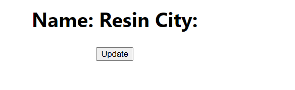
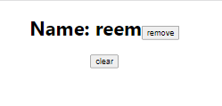

### React Hooks 
Hooks are a special function that helps us hook into React features. 
> Hooks are a new addition in React 16.8. 

- If your write a function component and realize you need to add some state to it, previously you had to convert it to class. Now you can use a hook inside the existing function component. 

> useState hook allows to add state to functional components 
> App.js (when you click on the button, name changes from "ree" to "Reem Shaikh")
```bash 
import React, { useState } from 'react'
import "./App.css"

const App = () => {
  let val = 'ree'

  // this is the iniital state 
  // it creates a useState object which contains the value ree 
  console.log(useState('ree'))

  // cuurent value, updated value 
  const [myName, setMyName]=useState('ree')

  const changeName = () => {
    // to change state inside function you need to use useState hook
    // val = "reem"
    // console.log('inside', val)

    setMyName('Reem Shaikh')
  }
  console.log('ouside', val)

  return (
    //including JS inside HTML - JSX

    <div>
      {/*<h1>{val}</h1> */}
      <h1>{myName}</h1>
      <button className='btn' onClick={changeName}>click me</button>
    </div>
  )
}

export default App

console:
(2) ['ree', ƒ]
App.js:20 ouside ree
```
> the problem with this approach was that, on clicking the button it changed the value, however if we wanted to go back to the previous value "ree" then we'd have to refresh the page, we need to now acheive toggling. 

### How to toggle the Data onClick using Hook 
> App.js 
```bash 
import React, { useState } from 'react'
import "./App.css"

const App = () => {
  let val;

  //this is the iniital state 
  console.log(useState('ree'))

  //cuurent value, updated value 
  const [myName, setMyName]=useState('ree')

  const changeName = () => {
    let val = myName;

    // if(val === 'ree'){
    //   setMyName('Reem Shaikh')
    // } else {
    //   setMyName('ree')
    // }

    (val === 'ree') ? setMyName('Reem Shaikh') : setMyName('ree')

  }
  console.log('ouside', val)

  return (
    //including JS inside HTML - JSX

    <div>
      {/*<h1>{val}</h1> */}
      <h1>{myName}</h1>
      <button className='btn' onClick={changeName}>click me</button>
    </div>
  )
}

export default App
```
### React Hook Rules 
1. Always write hook inside component or function (you cant write inside return)
2. component must always be in pascal case convention (first letter capital)
3. We can directly import useState 
> RuleHook.js
```bash 
import React, {useState} from 'react'

const RuleHook = () => {
  const [myName, setMyName] = useState('ree')
  return (
    <div> {myName} </div>
  )
}

export default RuleHook
```
- App.js 
```bash 
import React, { useState } from 'react'
import "./App.css"
import RuleHook from './component/RuleHook'

const App = () => {

  return (
    <div>
      <RuleHook></RuleHook>
    </div>
  )
}

export default App
```
- or if we want to use it only once we can write it as
> RuleHook.js
```bash 
import React from 'react'

const RuleHook = () => {
  const [myName, setMyName] = React.useState('ree')
  return (
    <div> {myName} </div>
  )
}

export default RuleHook
```
4. you cant call the complete hook inside loops / conditions / nested functions 
> RuleHook.js
```bash 
import React from 'react'

const RuleHook = () => {
❌if(true) {
  const [myName, setMyName] = React.useState('ree')
  //however you can call setMyName (function) inside conditionals 
  }

  return (
    <div> {myName} </div>
  )
}

export default RuleHook
```
### How to work with Arrays using useState hook 
when you click on clear it removes the element from the dom 

> UseStateArray.js
```bash 
import React, {useState} from 'react'

const UseStateArray = () => {
  const bioData = [
      {
          id:0, myName:"reem"
      }, 
      {
          id:1, myName:"resin"
      }
  ]
  console.log('array', bioData)

  const [myArray, setmyArray] = useState(bioData)

  const clearArray = () => {
      setmyArray([]);
  }

  return (
    <div>
        {
          myArray.map((currElem) => {
            return <h1 className='h1style' key={currElem.id}>Name: {currElem.myName} </h1>
          })
        }
        <button className='btn' onClick={clearArray}>clear</button>
    </div>
  )
}

export default UseStateArray
```
> App.js 
```bash 
import logo from './logo.svg';
import './App.css';
import UseStateArray from './component/UseStateArray';

function App() {
  return (
    <div className="App">
      <UseStateArray></UseStateArray>
    </div>
  );
}

export default App;
```


### Handling objects using UseState Hooks 
Get data from an object using useState, when you click on update button, update the value 

> UseStateObject.js 
```bash 
import React, {useState} from 'react'

const UseStateObject = () => {
  const [myObject, setMyObject] = useState({
      myName: "reem",
      city:"mumbai"
  })
  //this object is defined inside myObject 

  const changeObject = () =>{
      setMyObject({myName: "Resin", city:"Mumbai"})
  }

  return (
    <>
     <h1 className='h1style'>Name: {myObject.myName} City:{myObject.city}</h1>
     <button className='btn' onClick={changeObject}>Update</button>
    </>
  )
}

export default UseStateObject
```
> App.js 
```bash 
import logo from './logo.svg';
import './App.css';
import UseStateObject from './component/UseStateObject';

function App() {
  return (
    <div className="App">
      <UseStateObject></UseStateObject>
    </div>
  );
}

export default App;
```
> before clicking on update button 


> after clicking on update button 


#### When we dont set a value for one of the objects when the update button is clicked, then the object field shows no value 
> UseStateObject.js 
```bash 
import React, {useState} from 'react'
//rafce

const UseStateObject = () => {
  const [myObject, setMyObject] = useState({
      myName: "reem",
      city:"mumbai"
  })
  //this object is defined inside myObject 

  const changeObject = () =>{
        setMyObject({myName: "Resin"})
        // When we dont set a value for one of the objects when the update button is clicked, then the object field shows no value 
  }

  return (
    <>
     <h1 className='h1style'>Name: {myObject.myName} City:{myObject.city}</h1>
     <button className='btn' onClick={changeObject}>Update</button>
    </>
  )
}

export default UseStateObject
```
> on clicking on the update button


#### to only update one object value we use ternary operator (which is represented by ...)
> UseStateObject.js 
```bash 
import React, {useState} from 'react'

const UseStateObject = () => {
  const [myObject, setMyObject] = useState({
      myName: "reem",
      city:"mumbai"
  })
  //this object is defined inside myObject 

  const changeObject = () =>{
        setMyObject({...myObject, myName: "Resin"})
        // When we dont set a value for one of the objects when the update button is clicked, then the object field shows no value 
  }

  return (
    <>
     <h1 className='h1style'>Name: {myObject.myName} City:{myObject.city}</h1>
     <button className='btn' onClick={changeObject}>Update</button>
    </>
  )
}

export default UseStateObject
```
> Before clicking on update button 


> After clicking on update button 


#### To Do List 
remove individual elements on clicking on it 

> UseStateArray.js 
```bash 
import React, {useState} from 'react'

const UseStateArray = () => {
  const bioData = [
      {
          id:0, myName:"reem"
      }, 
      {
          id:1, myName:"resin"
      }
  ]
  console.log('array', bioData)

  const [myArray, setmyArray] = useState(bioData)

  const clearArray = ()=> {
      setmyArray([]);
  }

  const removeElem = (id)=> {
    // when we click on the 0th index id to delete it 
    // it stores all the other index ids in a new array called myNewArray 
    // and we set the display to myNewArray 

      const myNewArray = myArray.filter((currElem) => {
          return currElem.id != id
      })

      setmyArray(myNewArray)
  }

  return (
    <>
        {
          myArray.map((currElem) => {
            return <h1 className='h1style' key={currElem.id}>Name: {currElem.myName} 
            {/* to ensure that onclick on buttton removeelem should run, we add the fat arrow functio, if we didnt add it, it would call the function removeElem by default */}
            <button className='btnInner' onClick={ () => removeElem(currElem.id)}>remove</button></h1>
          })
        }
        <button className='btn' onClick={clearArray}>clear</button>
    </>
  )
}

export default UseStateArray

console:
array (2) [{…}, {…}]
0: {id: 0, myName: 'reem'}
1: {id: 1, myName: 'resin'}
length: 2[[Prototype]]: Array(0)
```
> before clicking on remove 


> after removing the element on 1st index 


