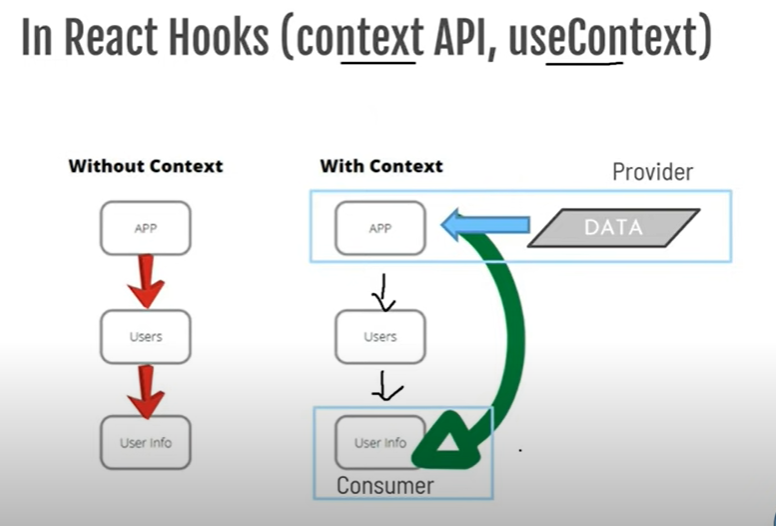
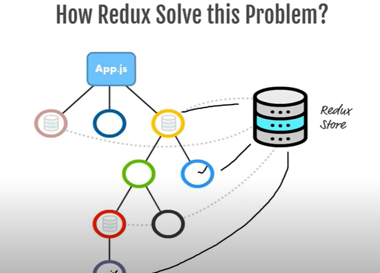
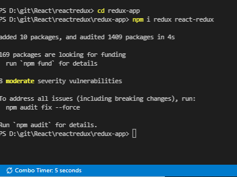
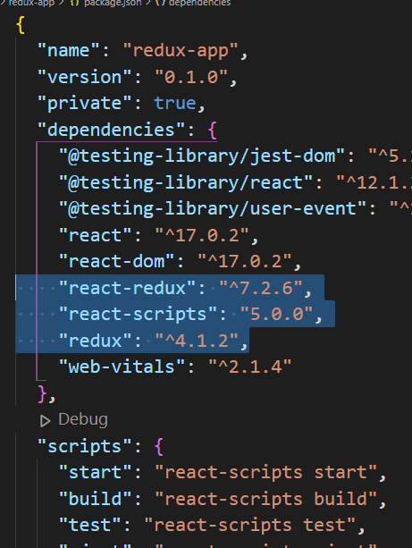
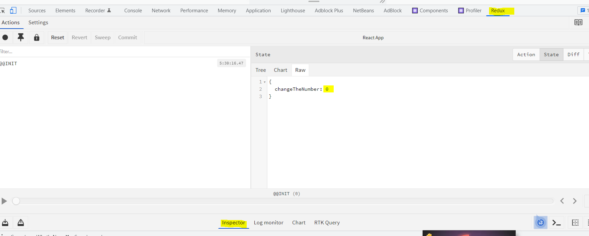
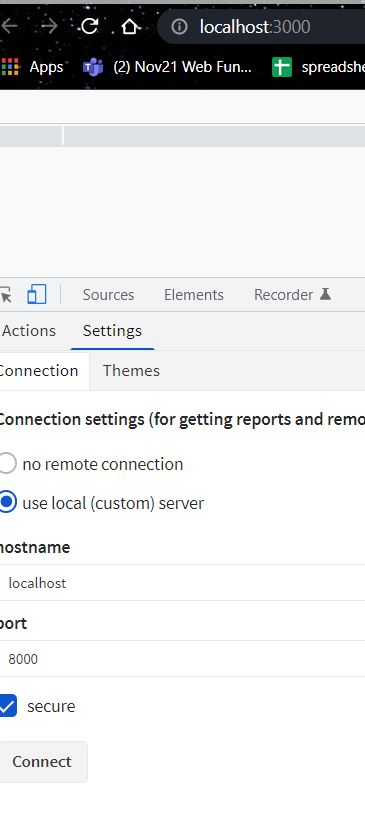

### Redux 
Redux is a state management library that helps you better manage state in your applications. (in short, redux helps in state management)

#### Why redux?
> data in react can flow from parent component to child component; data cannot be passed from child component to parent component -> data flow is unidirectional

- we can acheive this through prop drilling, where we pass data from one component to another, until we reach the child component, but the problem was whenver the data was needed it had to pass through multiple levels.
- to solve the issue of prop drilling, context API (useContext) was introduced, which allowed users to effectively produce global variables that can be passed around, without having to pass them at multiple levels. (where data was passed through provider and recieved through the consumer)


>> In redux data is stored in a seperate centralized storage (where apps state is stored), whenever any component want to fetch this data, it calls this redux store.  


Redux allows React components to read data from a Redux Store, and dispatch Actions to the Store to update data. 

#### What is redux?
Redux is a pattern and a library for managing an **updating application state** using **events called actions**. 
- it serves as a centralized store for state that needs to be used across your entire application, with rules ensuring that state can only be updated in a predictable fashion 
```bash 
Redux allows you to manage state for your web applications built in any JavaScript framework such as React, Meteor, or Angular.
```
#### React state VS Redux state 
**React state is stored locally within a component.*** When it needs to be shared with other components, it is passed down through props. In practice, this means that the top-most component in your app needing access to a mutable(can change) value will hold that value in its state.

When using Redux, **state is stored globally in the Redux store**. Any component that needs access to a value may subscribe to the store and gain access to that value. Typically, this is done using **container components**. This centralizes all data but **makes it very easy for a component to get the state it needs**, without surrounding components knowing of its needs.

### Redux main Topics:
1. Store - An Object that holds the applications state data (holds state of the application)
Redux store brings together the state, actions and reducers that make up your app.
```bash 
Note: you'll only have a single store in a redux application 
```
> creating a Redux store 
```bash 
import {createStore} from "redux";

const store = createStore(rootReducers)
//every Redux store has a single root reducer function 
```
2. Action - specifies what to do 
> eg: on event click, increement 

- Actions are plain JS objects, that have a type field. Actions only tells what to do, but they dont tell how to do. 
```bash
return {
    type: 'INCREEMENT',
    payload: num 
}
```
for a counter app, we will have 2 actions for increement and deecrement based on whether user clicks on increement or deecrement button 

#### Action Creator 
Action is created by action creator, which is a pure function 
```bash 
export const incrNumber = (num) => {
    return {
        type: 'INCREEMENT',
        payload: num 
    }
}
```
by calling the function incrNumber, you can tell the application that you want to increement, these functions are reusable, portable and easy to test 

3. Reducer - specifies how to do 
> Reducers know how to update the state by looking at the type of action coming in.

Reducers are functions that take **current state and an action as arguments** and return a new state result (updated state)
It checks which action took place and based on the action it updates the store.
```bash 
const initialState = 0; 

const changeTheNumber = (state = initialState, action) => {
    switch (action.type) {
        case 'INCREEMENT': return state + action.payload;
        case 'DEECREMENT': return state - 1;
        default: return state;
    }
}

So basically Reducer contains functionality for how the function can be acheived 
```
4. Functions associated with store 
```bash 
createStore() - for creating the Redux store 
dispatch(action) - for triggering action 
getState() - to get the current state 
```
### Redux Principles:
1. single source of truth 
The global state of your application is stored as an object inside a single store. There is only a single Redux store from where we can get data. 

2. State is read-only 
The only way to change the state is to dispatch an action 

3. Immutability(data cannot be changed)
4. one- way data flow only (from parent component to child component)
5. changes are made with pure reducer functions 

#### Downloading Dependencies to work with redux:
1. Install a normal react app using this command 
```bash 
npx create-react-app redux-app 
```
> then type 
```bash 
npm start 
```
2. then install the 2 dependencies required
- redux 
- react-redux 
```bash 
npm i redux react-redux
```


> navigate to package.json to ensure whether these dependencies were succesfully installed 


3. Add reduxDevTools chrome extension 
> then navigate to this git repo 
```bash 
https://github.com/reduxjs/redux-devtools
```
> scroll down and click on 'Browser extension installation & configuration' to add redux to console, which takes you to this link 
```bash 
https://github.com/reduxjs/redux-devtools/tree/main/extension#installation
```
> Here is a snippet of what we need to follow 
1. For a basic Redux store simply add:

```bash 
 const store = createStore(
   reducer, /* preloadedState, */
+  window.__REDUX_DEVTOOLS_EXTENSION__ && window.__REDUX_DEVTOOLS_EXTENSION__()
 );
```
> In our store.js, its going to look like this 
```bash 
import { createStore } from "redux"
//importing createstore from the dependency of redux 

import rootReducer from "./reducers/index";
//rootreducer contains the state of the entire application, which is extracted from the reducer function 

//store contains global centralized state 
✅const store = createStore(rootReducer, window.__REDUX_DEVTOOLS_EXTENSION__ && window.__REDUX_DEVTOOLS_EXTENSION__())
//whichever component calls the store, they will get the data stored in it 

export default store;
```
> Now run the app again and you'll find redux in console 
- navigate to inspector and you will notice that the function (changeTheNumber) we defined in upDown.js, which is basically the state that was passed to store.js through rootreducer

- changeTheNumber shows 0, because we initialized it to that. 

- make sure in the settings, you connect reduxextension to a different port than which your app is currently running 


#### The code: An analysis
> Functionality of the App:
```bash 
Whenever we click on +, it increements by 5 
whenever we click on -, it deecrements by 1 
```
> We create these folders with files inside src 
```bash 
> actions 
  index.js 

> reducers 
  index.js 
  upDown.js 

> store.js 
```
> App.js 
```bash 
import React from 'react'
//rafc - react arrow function component (shortcut key)

import "./App.css"

//instead of consumer that we use with provider in contextapi, we use useSelector with provider (index.js) in redux 
import { useSelector, useDispatch } from 'react-redux'
//we imported react-redux dependency from terminal above, were importing its libraries over here 

//dispatch triggers the action, basically we can use an action only with the help of dispatch 

//importing from action/index.js 
import {incNumber, decNumber} from "./actions/index.js"

 const App = () => {
   //components can get the data, that the provider sent at index.js through this line of code 
  const myState = useSelector((state)=> state.changeTheNumber)

  //declaring dispatch to trigger the action 
  const dispatch = useDispatch()

  return (
    <>
    <div className="container">
      <h1>Increement / Deecreement counter</h1>
      <h4> Using React and Redux</h4>
      <div className="quantity">
        <a className="quantity_minus" title="Decreement" onClick={()=> {
            dispatch(decNumber())
        }}><span>-</span></a>

        {/* components are getting the state over here  */}
        <input name="quantity" type="text" className="quantity_input" value={myState} />

        <a className="quantity_plus" title="Increement" onClick={()=> {
            dispatch(incNumber(5))
        }}><span>+</span></a>

      </div>
    </div>
    </>
  )
}

export default App;
```
> index.js 
```bash 
import React from 'react';
import ReactDOM from 'react-dom';
import './index.css';
import App from './App';
import reportWebVitals from './reportWebVitals';

//a centralized store that is passed to all components 
import store from './store'

//connecting react to redux using provider 
import { Provider } from 'react-redux'

ReactDOM.render(
  <React.StrictMode>

    {/* passing props to App.js through provider, which is then recieved through useSelector */}
    <Provider store={store}>
      <App />
    </Provider>
  </React.StrictMode>,
  document.getElementById('root')
);


reportWebVitals();
```
> actions/index.js 
```bash 
//actions performed on the app, must be mentioned over here 
//your specifying the app, what needs to be done, when a specific event has occured 

//when + button is clicked, title="Increement" is called
//over here, were passing an argument 'num' because were increasing the number by 5, in App.js and were storing it in payload, which is then accesed at reducer/upDown.js  
export const incNumber = (num) => {
    return {
        type: "INCREEMENT",
        payload: num 
    }
}

//when - button is clicked, title="Decreement" is called 
export const decNumber = () => {
    return {
        type: "DECREEMENT"
    }
}
```
> reducer/upDown.js 
```bash 
//were going to specify the code for the functions we defined inside actions/index.js 

//we dont need to import action/index.js in order to use it in reducer 

//were specifying how the action is going to be performed inside the reducer 
const initialState = 0 
const changeTheNumber = (state = initialState, action) => {
    switch(action.type) {
        //whats the type of the action that is called 
        case "INCREEMENT": return state + action.payload; 
        //state will be updated 

        case "DECREEMENT": return state - 1;
        default: return state;
    }
}

export default changeTheNumber;
```
> reducer/index.js (all the reducers we defined will be combined in this file under rootReducer by using the combineReducer)
```bash 
//import all reducers in reducer/index.js 
import changeTheNumber from "./upDown";

//to combine multiple reducers 
import { combineReducers } from "redux"

//there is only one reducer 
const rootReducer = combineReducers({
    //we can add as many reducers inside this seperated by commas 
    changeTheNumber
})

export default rootReducer
```
> store.js 
```bash 
import { createStore } from "redux"
//importing createstore from the dependency of redux 
import rootReducer from "./reducers/index";

//rootreducer contains the state of the entire applicaion
//store contains global centralized state 
const store = createStore(rootReducer, window.__REDUX_DEVTOOLS_EXTENSION__ && window.__REDUX_DEVTOOLS_EXTENSION__())
//whichever component calls the store, they will get the data stored in it 

export default store;
```
-----